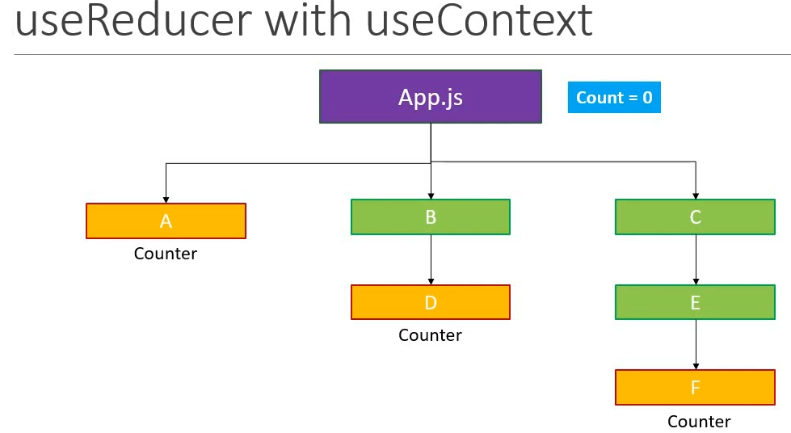

;
useReduce = Local State management
useContext = Global State management
useReduce + useContext

Example01:

    App.js => (CompA.js, CompB.js, CompC.js)

    CompA
    CompB => CompBD
    CompC => CompCE