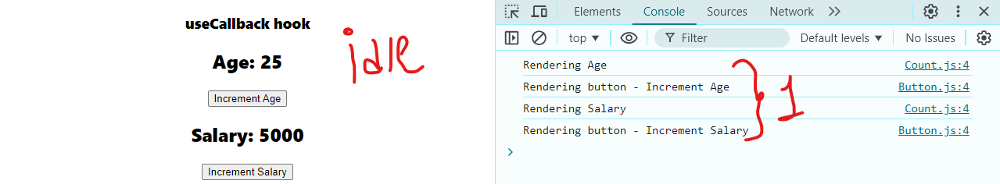
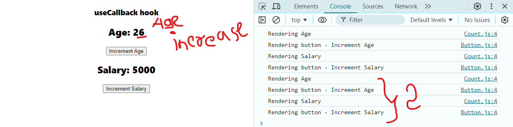
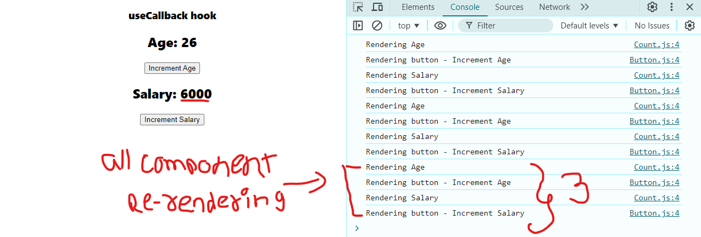
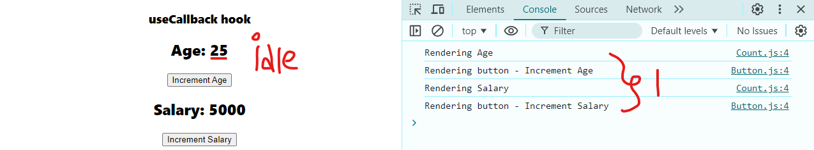
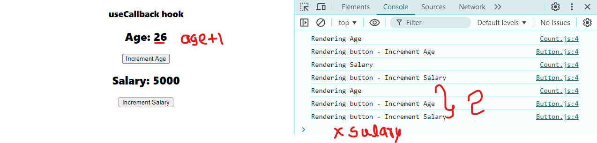
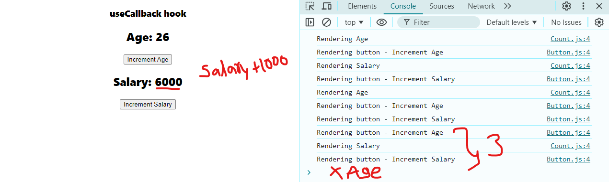
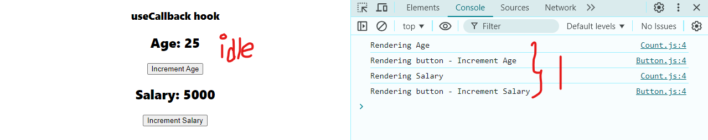
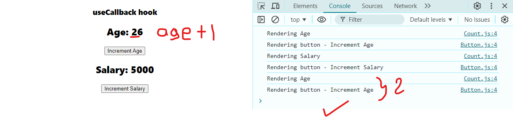
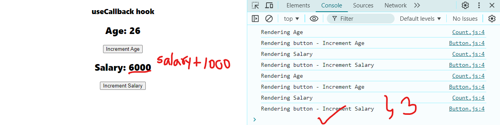

This folder has 1 parent-component & 3 sub-components inside it.

>ParentComponent.js
>> - Button.js
>> - Count.js
>> - Title.js

---

when render the one component by event like a trigger, all the sub-components get re-rendered.

---

---


although this seems fine becuase its just 3 components re-rendering but when we have more than 10 component, which will re-render themselve each event it will kill the app optimization 

---

to tackle this we can use React memo feature.

```javascript
export default React.memo(Button)
```
```javascript
export default React.memo(Button)
```
```javascript
export default React.memo(Count)
```
```javascript
export default React.memo(Button)
```

---

now lets try this again

---

we can see, using React.Meme it only re-render changed values. it did not re-rendered the salary but.... it did re-rendered button of salary, becuase its same component with different props (age & salary)
---

& same goes when we increase salary
---


*to solve this situation, we need **useCallback** hook*
- **what?**
> useCallback is a hook that return a memorized version of the callback function that only changes if one of he dependency has changed
- **why?**
> it is useful when passing callbacks to optimize child components that rely on reference equality to prevent unnecessary renders

After using `useCallback()`


---

we can see here only age & button with age prop is re-rendered
---

---
