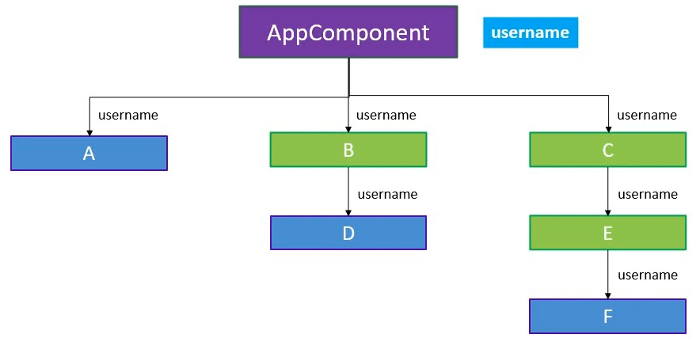

in this image we can see, we need to pass a prop (username) at every bit of level.

so isn't it would be nice to send data via props directly only to desired component 😼

**info**
Context provide a way to pass data through the component tree without having to pass props down manually at every level.

