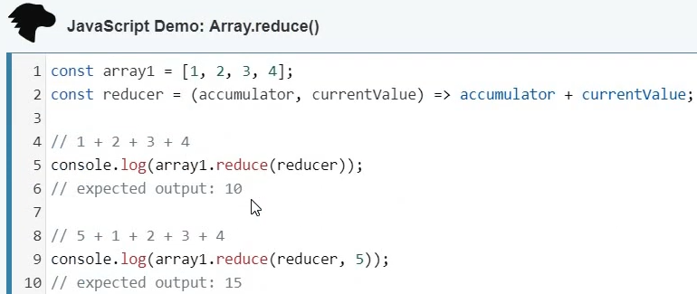

***What us useReducer***
- useState & useReduce are both built for state management
- but difference is useState is built using useReducer, which mean useReducer is primitive to useState

useReduce is work similar to Array.reduce() from vanilla JS



**How to Use**
# A. simple reducer
RH_useReducer01:
1. inside functional component: create a destructered array with using useReduce
  `const[count, logic] = useReducer(reducer, startValue)`

2. outside functional component: declare startValue variable & reducer function
```javascript

const startValue = 0;

function reducer(currentState, operation){

  switch(operation){
    case "increment":
      return currentState + 1;
    case "decrement":
      return currentState - 1;
    case "reset":
      return startValue;
    default:
      return currentState;
  }
  
}
```
3. give the proper jsx

```jsx
        <h1>Counter: {count}</h1>
        <br />
        <button onClick={()=> logic("increment")}>Increment</button>
        <button onClick={()=> logic("decrement")}>Decrement</button>
        <button onClick={()=> logic("reset")}>Reset</button
```

# B. useReducer for an object
RH_useReducer02

# C. multiple useReducer
RH_useReducer03
<!-- this file will tell us how to use single snippet if multiple element have same logic -->

