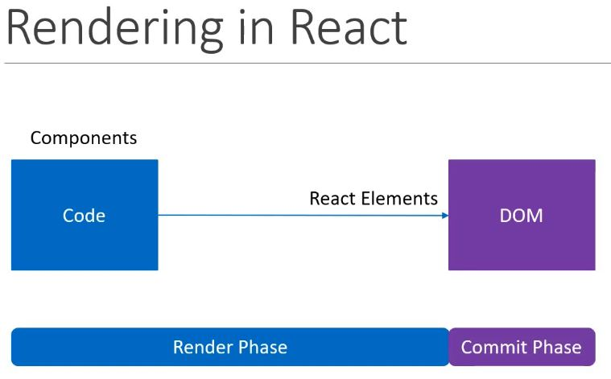
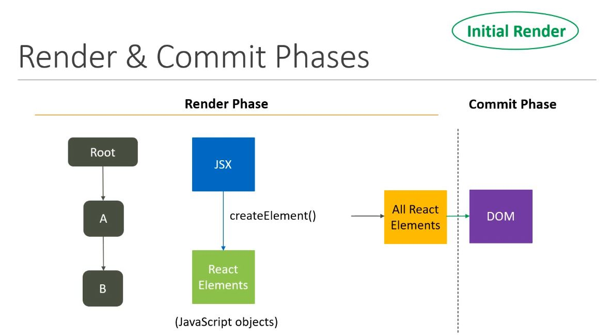
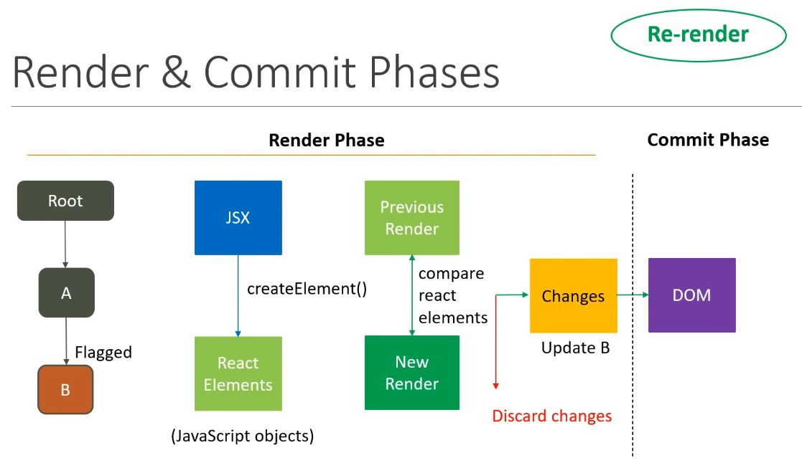
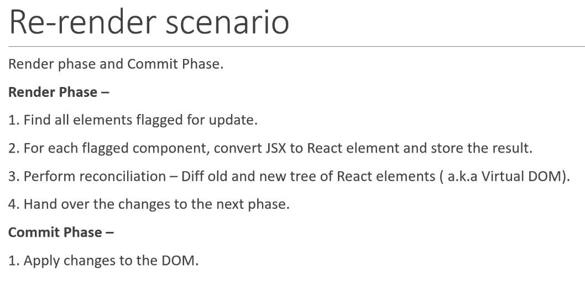

### React default rendering

### React re-rendering

- React Docs: **The commit phase us usually very fast, but rendering can be slow.**

### Rre-rendering Scenario

> to understand this concept we need to disable ReactStrict mode, because it logs the same console twice.