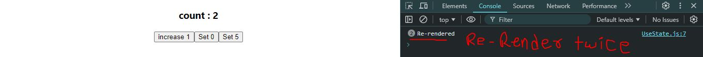
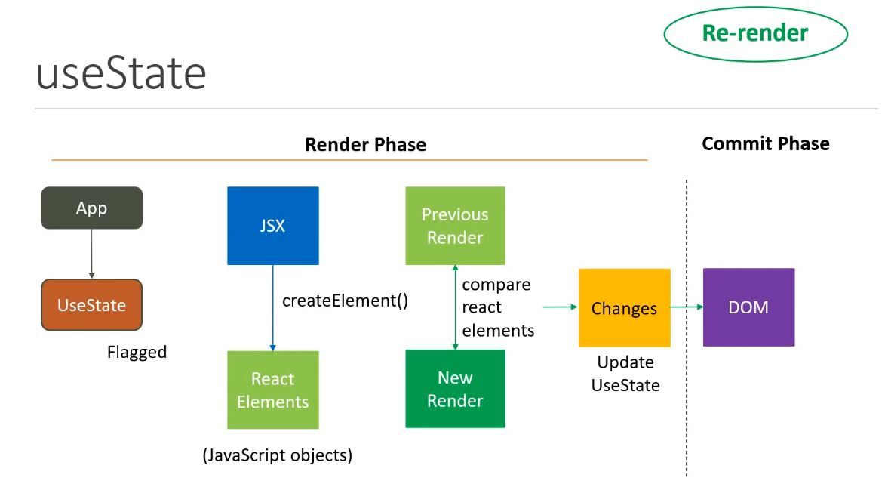
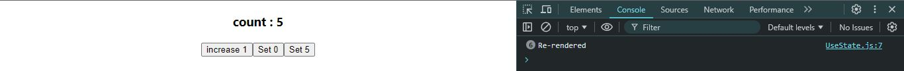
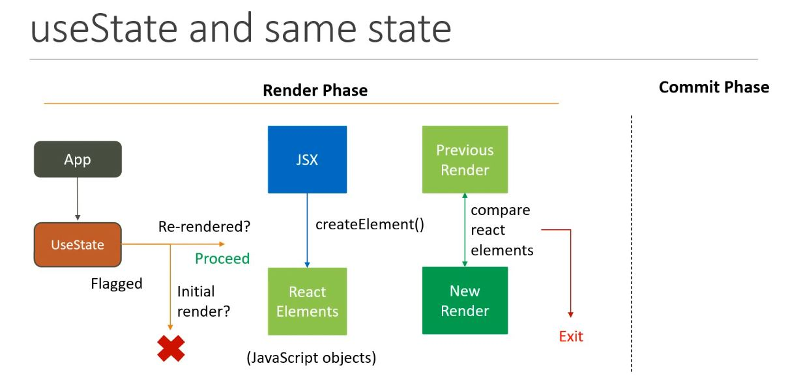
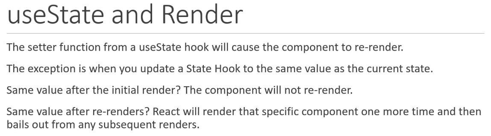

> to understand this concept we need to disable ReactStrict mode, because it logs the same console twice.

```javascript
import React, { useState } from 'react'

function UseState() {

    const [count, setCount] = useState(0);

    console.log("Re-rendered"); // will give message every time after component re-render

  return (
    <div>
    
    <h3>count : {count}</h3>
    <button onClick={()=> setCount( c => c+1)} >increase 1</button>
    <button onClick={()=> setCount(0)} >Set 0</button>
    <button onClick={()=> setCount(5)} >Set 5</button>
      
    </div>
  )
}

export default UseState
```
1. Idle state => **First Log Cleared**  
⬇️

2. Idle state => **First Log Cleared** ➡️ **increase 1(1st)** ➡️ **increase 1(2nd)**  
⬇️





3. Idle state => **First Log Cleared** ➡️ **Set 0(1st)** ➡️ **Set 0(2nd)**  
⬇️

here state did not changed because current value is 0 & button setting the same to 0. so there is no change current value. hence no re-rendering occured.

4. Idle state => First Log Cleared ➡️ increase 1(1st) ➡️ increase 1(2nd) ➡️ increase 1(3rd) ➡️ increase 1(4th) ➡️ increase 1(5th) ➡️ **Set 5(1st)** ➡️ **Set 5(2nd)**

here (**icrease 1** x 5 times) + (**set 5** x 1 time) = 6 times Re-rendered, but after that no-matter how many times you click on **set 5** it will not Re-render that component because the current value is already **5**.




