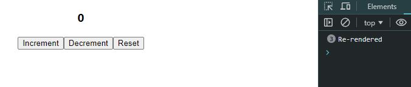

> latest React userReducer is somewhat downgrade, cause it re-render even the value is same (Sep - 2024)
```javascript
import React, { useReducer } from 'react'


const intialState = 0;

const reducer = (state, action) => {
    switch(action){
        case "increment":
            return state + 1;
        case "decrement":
            return state - 1;
        case "reset":
            return intialState;    
        default: return state;    
    }
}

function UseReducer() {

    const [count, dispatch] = useReducer(reducer, intialState);

    console.log("Re-rendered");
  return (
    <div>
    <h3>{count}</h3>
    <button onClick={()=> dispatch("increment")} >Increment</button>
    <button onClick={()=> dispatch("decrement")} >Decrement</button>
    <button onClick={()=> dispatch("reset")} >Reset</button>
      
    </div>
  )
}

export default UseReducer
```


1. Idle state => **First Log Cleared** ➡️ **increase (1st)** ➡️ **decrease (1st)** ➡️ **reset (1st)**  
⬇️

as we expected, when changes the useReducer value 3 times, component Re-render 3 times.


2. Idle state => **First Log Cleared** ➡️ **increase (1st)** ➡️ **decrease (1st)** ➡️ **reset (1st)**  ➡️ **reset (2nd)**    ➡️ **reset (multiple times)**  
⬇️

seems like useReducer doesn't give much about re-render principles cause it re-renders itseld descpite value being same.