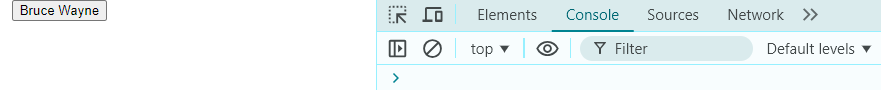
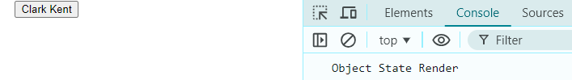
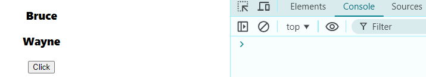
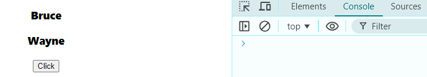
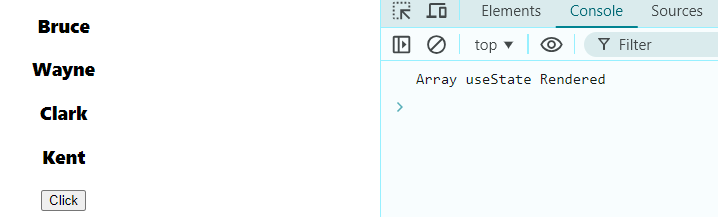

> in recent useState & useReducer Hook we seen how rendering works with primitive datatye, now lets see how it behaves with non-primitive datatype (object, array)

# 1. Object
```Javascript
import React, { useState } from 'react'

const initState = {
    fname: "Bruce",
    lname: "Wayne"
}

export const ObjectState = () => {

    const [person, setPerson] = useState(initState); 

    const changeName = ()=>{
        person.fname = "Clark";
        person.lname = "kent";
        setPerson(person);
    }

    console.log("Object State Render");

  return (
    <div>
    <button
    onClick={changeName}
    >{person.fname} {person.lname}</button>
    </div>
  )
}
```
1. Idle state => **First Log Cleared**  
⬇️

2. Idle state => **First Log Cleared** => **Button Click**  
⬇️


nothing change in value or no rendering occured.  
because when we make changes directly in object it donot have 2 variation of object to compare between, this is the most common mistake React beginner makes.

> thus, we need to use sprad operator in ChangeName() function  

__only snippet__
```javascript
    // const changeName = ()=>{
    //     person.fname = "Clark";
    //     person.lname = "kent";
    //     setPerson(person);
    // }

    const changeName = ()=>{
    const newPerson = {...person};
    newPerson.fname = "Clark";
    newPerson.lname = "Kent";
    setPerson(newPerson);
    }
```
__Full Code__

```javascript
import React, { useState } from 'react'

const initState = {
    fname: "Bruce",
    lname: "Wayne"
}

export const ObjectState = () => {

    const [person, setPerson] = useState(initState); 

    // const changeName = ()=>{
    //     person.fname = "Clark";
    //     person.lname = "kent";
    //     setPerson(person);
    // }

    const changeName = ()=>{
    const newPerson = {...person};
    newPerson.fname = "Clark";
    newPerson.lname = "Kent";
    setPerson(newPerson);
    }

    console.log("Object State Render");

  return (
    <div>
    <button
    onClick={changeName}
    >{person.fname} {person.lname}</button>
    </div>
  )
}
```

> By using spread operator we compared Object ***person*** with ***newPerson*** & then rendering & change in value occures.  

3. Idle state => **First Log Cleared** => **Button Click**  
⬇️  



# 2. Array

```javascript
import React, { useState } from 'react'

const initState = ["Bruce", "Wayne"];

const ArrayState = () => {

    const [person, setPerson] = useState(initState);

    const handleClick = ()=>{
        person.push("Clark");
        person.push("Kent");
        setPerson(person)
    }
    
    console.log("Array useState Rendered");
  return (
    <div>
    {
        person.map(item => <h3 key={item} >item</h3>)
    }
      <button onClick={handleClick}>Click</button>
    </div>
  )
}

export default ArrayState
```

1. Idle state => **First Log Cleared**  
⬇️  

2. Idle state => **First Log Cleared** => **Button Click**  
⬇️  
  
> nothing changed or rendered because like previous example of object we are making changes in current Array, so there is nothing to compare between. if the problem is same then the solution is same also. using spreat operator create copy of current array & compare & make changes using newArray.  

3. Idle state => **First Log Cleared** => **Button Click**  
⬇️  

__only snippet__
```javascript
    // const handleClick = ()=>{
    //     person.push("Clark");
    //     person.push("Kent");
    //     setPerson(person)
    // }

    function handleClick(){
        const newPerson = [...person];
        newPerson.push("Clark");
        newPerson.push("Kent");
        // newPerson[0] = "Clark"
        // newPerson[1] = "Kent"
        setPerson(newPerson);
    }
```
__Full Code__
```javascript
import React, { useState } from 'react'

const initState = ["Bruce", "Wayne"];

const ArrayState = () => {

    const [person, setPerson] = useState(initState);

    // const handleClick = ()=>{
    //     person.push("Clark");
    //     person.push("Kent");
    //     setPerson(person)
    // }

    function handleClick(){
        const newPerson = [...person];
        newPerson.push("Clark");
        newPerson.push("Kent");
        // newPerson[0] = "Clark"
        // newPerson[1] = "Kent"
        setPerson(newPerson);
    }

    console.log("Array useState Rendered");
  return (
    <div>
    {
        person.map(item => <h3 key={item} >{item}</h3>)
    }
      <button onClick={handleClick}>Click</button>
    </div>
  )
}

export default ArrayState
```