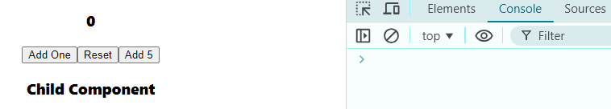
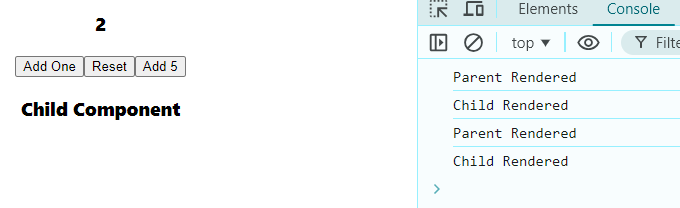
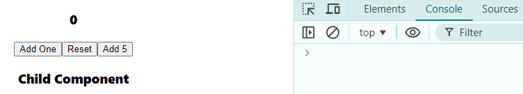
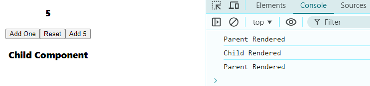

> lets see rendering behaviour on Parent & Child Component


### Parent Component
```javascript
import React, { useState } from 'react'
import PCC_Child from './PCC_Child';

function PCC_Parent() {

    const [count, setCount]= useState(0);

    console.log("Parent Rendered");

  return (
    <div>

    <h3>{count}</h3>
    <button onClick={()=> setCount((c)=> c+1)} >Add One</button>
    <button onClick={()=> setCount(0)} >Reset</button>
    <button onClick={()=> setCount(5)} >Add 5</button>

    <PCC_Child />
      
    </div>
  )
}

export default PCC_Parent
```

### Child Component
```javascript
import React from 'react'

function PCC_Child() {
    console.log("Child Rendered");
  return (
    <div>
    <h3>Child Component</h3>
    </div>
  )
}

export default PCC_Child
```

1. Idle state => **First Log Cleared**  
⬇️  
  
as we learned so far, we know that react dono re-renders on unchanged values, lets go through that again
2. Idle state => **First Log Cleared** ➡️ **Add One(X2)**   
⬇️  
  
here we can see changing on each value, both parent & child component is re-rendering each time.  
3. Idle state => **First Log Cleared** ➡️ **Reset(X5)**   
⬇️  
  
here we can see setting 0 value to 0 is not going to re-rendering anything at all.  
3. Idle state => **First Log Cleared** ➡️ **Add 5(1st)** ➡️ **Add 5(2nd)**    
⬇️  
 
here, on first **Add 5** it changes value 0 to 5, on second **Add 5** it only rendered Parent Component (as safety measure) but not child. this is an exception case, which reduce unnecessary renders. we will discuss about unnecessary renders in next chaper.
