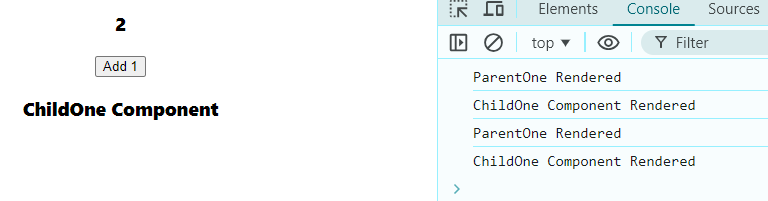

> Unnecessary Renders  
When a parent component renders, React will recursively render all of its child components.
"Unnecessary renders" is where the child component goes through the renders phase but not the commit phase.  

Note: this method is without using React.memo  
### ParentOne Component
```javascript
import React, { useState } from 'react'
import ChildOne from './ChildOne';

function ParentOne() {

    const [count, setCount] = useState(0);

    console.log("ParentOne Rendered");

  return (
    <div>
    <h3>{count}</h3>
    <button onClick={()=> setCount((c)=>c+1)} >Add 1</button>
    <ChildOne/>
    </div>
  )
}

export default ParentOne
```
### ChildOne Component
```javascript
import React from 'react'

function ChildOne() {
    console.log("ChildOne Component Rendered");
  return (
    <div>
      <h3>ChildOne Component</h3>
    </div>
  )
}

export default ChildOne
```

1. Idle state => **First Log Cleared**  
⬇️  
  
2. Idle state => **First Log Cleared** ➡️ **Add One(X2)**   
⬇️  
  
here we can say **Child component** is not changing a single value from it, but still it being rendered along with **Parent Component**
- To Optimize this we need to perform those things
> 1. Remove Child component from parent
> 2. Add Child Component inside Parent Tag Literals
```jsx
    <ParentOne>
        <ChildOne/>
    </ParentOne>
```  
like this
> 3. Destructure Child Component from Props & include it in JSX
```javascript
// import React, { useState } from 'react'

function ParentOne({children}) {

//     const [count, setCount] = useState(0);

//     console.log("ParentOne Rendered");

//   return (
//     <div>
//     <h3>{count}</h3>
//     <button onClick={()=> setCount((c)=>c+1)} >Add 1</button>
    {children}
//     </div>
//   )
// }

// export default ParentOne
```

4. Idle state => **First Log Cleared**  
⬇️  
  
5. Idle state => **First Log Cleared** ➡️ **Add One(X2)**   
⬇️  
  
now, here we can see that no unnecessary re-rendering occured.

but here is a catch this is not suitable for nested components, its React.memo which is more suitable for these kind of operation.


