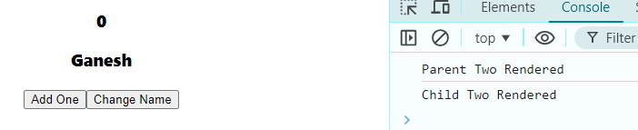
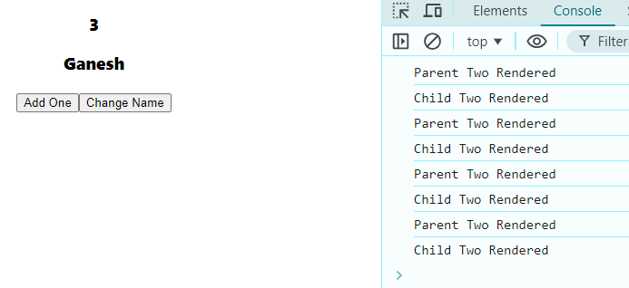
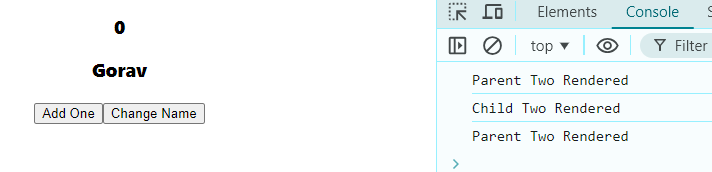
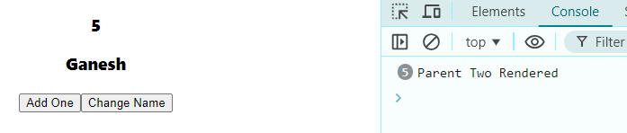

# Before React.memo()

### Parent
```javascript
import React, { useState } from 'react'
import ChildTwo from './ChildTwo';

function ParentTwo() {

    const [count, setCount] = useState(0);
    const [name, setName] = useState("Ganesh");

    console.log("Parent Two Rendered");

  return (
    <div>
      <h3>{count}</h3>

      {/* nextline is only Child Component */}
      <ChildTwo name={name}/>

      <button onClick={()=> setCount(c=>c+1)}>Add One</button>
      <button onClick={()=> setName("Gorav")}>Change Name</button>
    </div>
  )
}

export default ParentTwo
```
### Children
```javascript
import React from 'react'

function ChildTwo({name}) {
    console.log("Child Two Rendered");
  return (
    <div>
      <h3>{name}</h3>
    </div>
  )
}

export default ChildTwo
```


1. Idle state => **First Log Cleared**  
⬇️  
  
2. Idle state => **First Log Cleared** ➡️ **Add One(X3)**   
⬇️  
  
we can see it rendering both component every time we add 1  
3. Idle state => **First Log Cleared** ➡️ **Change Name(X3)**   
⬇️  
  
Change Name 1st ➡️Changed name Ganesh to Gorav (both re-rendered)  
Change Name 2nd ➡️no changes (safe rendered only parent)  
Change Name 3rd ➡️no changes (no rendering at all / React exceptional rendering)  

react does't care if props changes or not, it will re-render the child component if parent component get re-renders


# After React.memo()


### Parent
```javascript
// import React, { useState } from 'react'
import { MemorizedChildTwo } from './ChildTwo';

// function ParentTwo() {

//     const [count, setCount] = useState(0);
//     const [name, setName] = useState("Ganesh");
//     console.log("Parent Two Rendered");

//   return (
//     <div>
//       <h3>{count}</h3>

       {/* nextline is only Child Component */}
      <MemorizedChildTwo name={name}/>

//       <button onClick={()=> setCount(c=>c+1)}>Add One</button>
//       <button onClick={()=> setName("Gorav")}>Change Name</button>
//     </div>
//   )
// }
// export default ParentTwo
```
### Children
```javascript
// import React from 'react'
// function ChildTwo({name}) {
//     console.log("Child Two Rendered");
//   return (
//     <div>
//       <h3>{name}</h3>
//     </div>
//   )
// }
// export default ChildTwo

export const MemorizedChildTwo = React.memo(ChildTwo);
```

4. Idle state => **First Log Cleared** ➡️ **Add One(X5)**   
⬇️  
  

and the Change name behaviour remains same (because its actual change).


> In React, when a paren component renders, a child component might un-necessarily render.

> To Optimize this behaviou, you can use React.memo() and pass child component.

> React.memo will perform a shallow comparison of the previous and new props and re-render the child component only if the props have changed