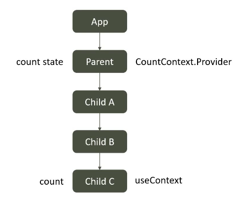
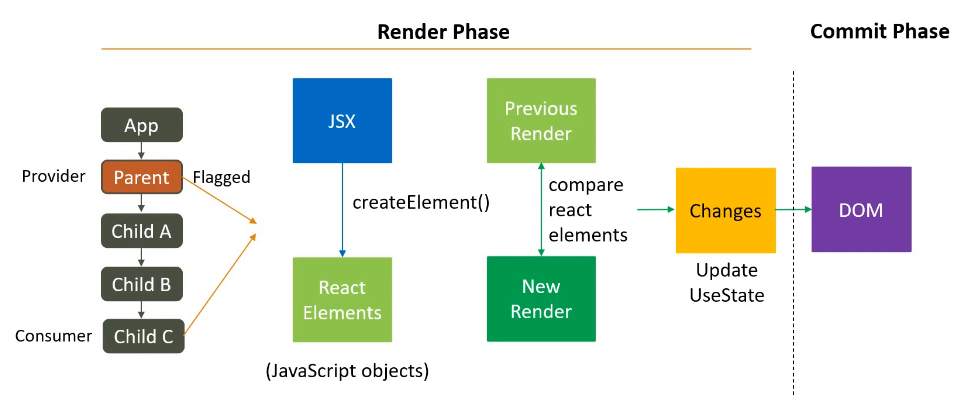

# Deprecated / Expired concept

## 1. Problem

As far we know there are 2 reason which cause a re-render       
**1. Component calls useState setter function or useReducer dispatch function**  
**2. If Parent component re-renders**

but there is 3rd reason which causes React-Re-Render, which is  
**3. React Context**  
lets see what is that exactly  
;
;

### Parent
```javascript
import React, { useState } from 'react'
import { ChildA } from './ChildrenRC';

export const CountContext = React.createContext();
const CountProvider = CountContext.Provider; 

function ParentRC() {
    const [count, setCount] = useState(0);
    console.log("Parent Rendered");
  return (
    <div>
      <h3>Count: {count}</h3>
      <button onClick={()=> setCount(c=>c+1)} >Add</button>

      <CountProvider value={count}>
            <ChildA />
      </CountProvider>

    </div>
  )
}

export default ParentRC
```
### Children
```javascript
import React, {useContext} from 'react'
import { CountContext } from './ParentRC';

export function ChildA() {
    console.log("Child A Rendered");
  return (
    <div>
      <h3>Child A</h3>
      <ChildB />
    </div>
  )
}
//////////////////////////////////
export function ChildB() {
    console.log("Child B Rendered");
  return (
    <div>
      <h3>Child B</h3>
      <ChildC />
    </div>
  )
}
//////////////////////////////////
export function ChildC() {
    const variAble = useContext(CountContext) 
    console.log("Child C Rendered");
  return (
    <div>
      <h3>Child C: {variAble}</h3>
    </div>
  )
}
```
1. Idle state => **First Log Cleared**  
⬇️  
  
2. Idle state => **First Log Cleared** ➡️ **Add One(X1)**   
⬇️  
  


## 2. Solution

### Parent
```javascript
// import React, { useState } from 'react'
import { MemorisedChildA } from './ChildrenRM';

// export const CountContext = React.createContext();
// const ContextProvider = CountContext.Provider;

// function ParentRM() {
//     const [count, setCount] = useState(0)

//     console.log("Parent Rendered");
//   return (
//     <div>
//     <h3>Count: {count}</h3>
//     <button onClick={()=>setCount(c=>c+1)}>Add</button>
//     <ContextProvider value={count}>
        <MemorisedChildA />
//     </ContextProvider>

//     </div>
//   )
// }

// export default ParentRM
```
### Children
```javascript
// import React, { useContext } from 'react'
// import { CountContext } from './ParentRM';

// export function ChildA() {
//     console.log("ChildA Rendered");
//   return (
//     <div>
//       <h3>ChildA</h3>
//       <ChildB />
//     </div>
//   )
// }
// /////////////////////////////////
export const MemorisedChildA = React.memo(ChildA);

// export function ChildB() {
//     console.log("ChildB Rendered");
//   return (
//     <div>
//       <h3>ChildB</h3>
//       <ChildC />
//     </div>
//   )
// }
// /////////////////////////////////
// export function ChildC() {
//     const variAble = useContext(CountContext)
//     console.log("ChildC Rendered");
//   return (
//     <div>
//       <h3>ChildC: {variAble}</h3>
//     </div>
//   )
// }
```

Although new version of React self optimize the Context it is still better to use React.Memo
> Performance Optimization  
> Improved Rendering Behavior  
> Code Clarity and Intent  
> Ease of Use


# Another solution instead of React.Memo()

Same Element Reference Technique

### App
```javascript
import './App.css';
import ParentRM from './React_Renders/10_Cause_Of_React_Render/Solution (ReactMemo)/ParentRM';
import { ChildA } from './React_Renders/10_Cause_Of_React_Render/Solution (ReactMemo)/ChildrenRM';


function App() {
  return (
    <div className="App">
    <ParentRM>
    <ChildA />
    </ParentRM> 
    </div>
  );
}

export default App;

```
### Parent
```javascript
import React, { useState } from 'react'
import { MemorisedChildA } from './ChildrenRM';

export const CountContext = React.createContext();
const ContextProvider = CountContext.Provider;

function ParentRM({children}) {
    const [count, setCount] = useState(0)

    console.log("Parent Rendered");
  return (
    <div>
    <h3>Count: {count}</h3>
    <button onClick={()=>setCount(c=>c+1)}>Add</button>
    <ContextProvider value={count}>
        {children}
    </ContextProvider>

    </div>
  )
}

export default ParentRM
```
### Children
```javascript
import React, { useContext } from 'react'
import { CountContext } from './ParentRM';

export function ChildA() {
    console.log("ChildA Rendered");
  return (
    <div>
      <h3>ChildA</h3>
      <ChildB />
    </div>
  )
}
/////////////////////////////////
export const MemorisedChildA = React.memo(ChildA);

export function ChildB() {
    console.log("ChildB Rendered");
  return (
    <div>
      <h3>ChildB</h3>
      <ChildC />
    </div>
  )
}
/////////////////////////////////
export function ChildC() {
    const variAble = useContext(CountContext)
    console.log("ChildC Rendered");
  return (
    <div>
      <h3>ChildC: {variAble}</h3>
    </div>
  )
}
```